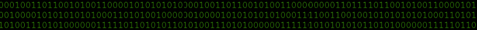
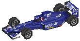
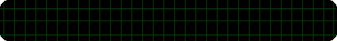

    

    
    
    

    

---
<!-- small about me here -->

    

    

    <table width="100%">
    <tr>
        <td align="center">
            
        </td>
        <td align="center">
            
        </td>
    </tr>
    <tr>
        <th colspan="2">And more to come!</th>
    </tr>
</table>

    

    <table width="100%">
    <tr>
        <th colspan="3">Check this stuff out</th>
    </tr>
    <tr>
        <td align="center">
        <a href="https://adrim.art">
        <strong>My website</strong>
        

         
        
        </a>
        

        </td>
        <td align="center">
        <!-- <a href=" - "> -->
        <strong>Sign my guest book!</strong>
        

             
            
            </a>
        

        </td>
        </td>
        <td align="center">
        <strong>Github Stats</strong>
        

             
            
             
            
        

        </td>
    </tr>
    </table>

    
    
    
    
    

    

